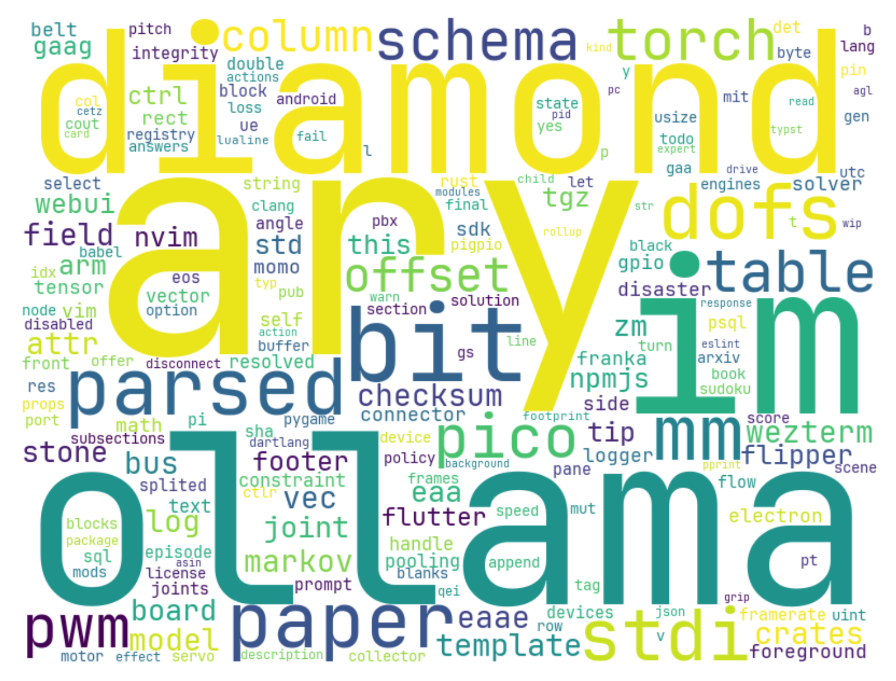

# Repos Word Cloud

## description

Scrape your repositories and generate a word cloud picture from your programs.

## example



## usage

### put font file

- Create `font` directory.
- Put a `ttf` file in `font` directory.

### make config.json

```json
{
  "font": "font/[putted-font].ttf",
  "size": {
    "width": 800,
    "height": 600
  },
  "max_words": 200,
  "repos": [
    "https://github.com/Oya-Tomo/repos-wordcloud",
    "https://github.com/..."
  ]
}
```

### run docker container

```shell
docker compose up
```

### get picture

- Generated picture will be in `export` directory.
